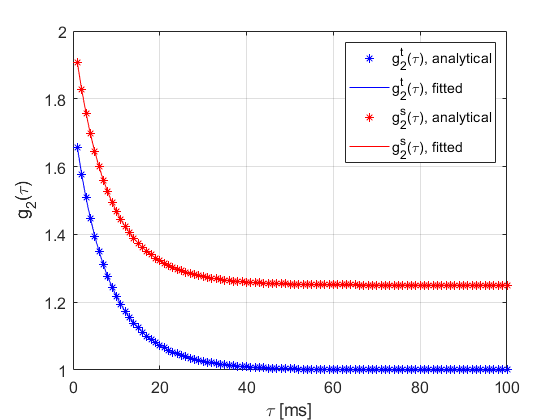
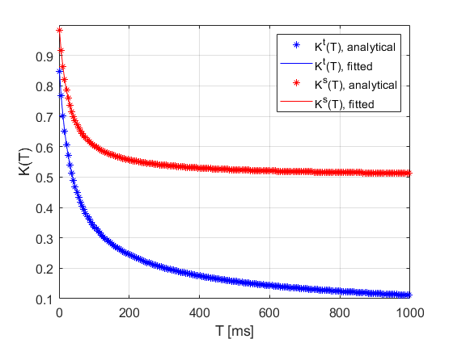

# SpeckleDynamicsModelFitting

We provide our model fitting functions to extract speckle dynamics information from temporal 
and spatial g_2 autocorrelatio function and multi-exposure speckle contrast measurements for both single and mixed dynamics without explicit expressions of contrast model.

To run the code:

1. Download all the files in one folder
2. Run demo.m 

After you run the demo.m provided, the analytical spatial and temporal g_2 and K with single dynamics are generated and the fitting results based on the anayltical data are demostrated as:

  
For any issue reporting or suggestions, please contact Bingxue Liu, bliu97@bu.edu

Updated 10/12/2023